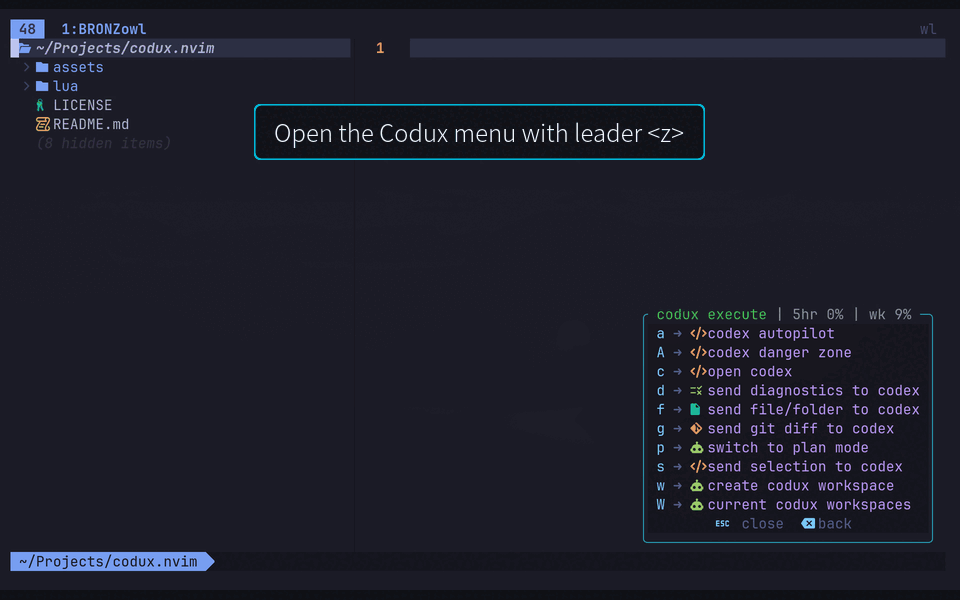
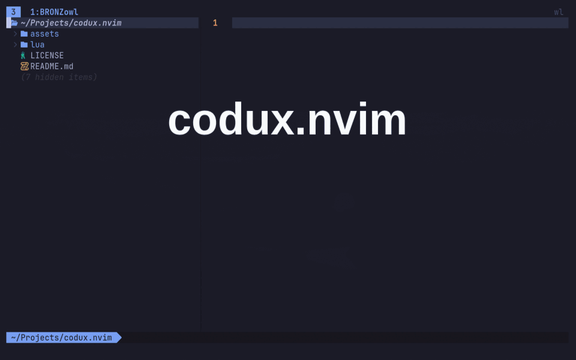

<p align="center">
  
</p>

<p align="center">
  <a href="https://neovim.io/"></a>
  <a href="LICENSE"></a>
  
  
  <a href="https://github.com/BRONZowl/codux.nvim"></a>
</p>

<p align="center">
  <strong>Persistent AI coding agents inside Neovim — Codex and Grok, workspaces, and Mission Control.</strong>
</p>

<p align="center">
  Keep your agent next to the code. Send context in one keystroke. Run parallel workstreams.
  Coordinate multi-role missions without leaving the editor.
</p>

<p align="center">
  <a href="#installation"><strong>Install in minutes →</strong></a>
  ·
  <a href="#quick-start"><strong>Quick Start</strong></a>
  ·
  <a href="#showcase--demos"><strong>See it in action</strong></a>
</p>

---

## Features

- **Persistent sessions** — Open a floating agent terminal, hide it, keep coding; the process keeps running until you exit it.
- **Codex + Grok, first-class** — One plugin surface for both CLIs: open, workspaces, missions, profiles, and status.
- **Editor-native context** — Send the current file, visual selection, diagnostics, or Git diff straight into the active agent.
- **Permission profiles** — Start with **default**, **auto**, or **full access**; new sessions default to **plan mode** for safer iteration.
- **Codux workspaces** — tmux-backed windows with isolated Git worktrees, instruction files, and saved state per stream of work.
- **Mission Control** — Launch multi-role crews around a shared objective, with a live dashboard, Manager coordination, and focus packets.
- **Token & status monitoring** — Live usage in the which-key header; Codex rate windows and Grok TPM/RPM headroom.
- **Doctor & health** — `:checkhealth codux` and `:CoduxDoctor` for CLI, tmux, and workspace diagnostics.

---

## Requirements

| Requirement | Notes |
| --- | --- |
| **Neovim** | Terminal + floating window support |
| **Agent CLI** | OpenAI **Codex** (`codex`) and/or xAI **Grok** (`grok`) |

**Optional**

| Dependency | Why |
| --- | --- |
| [which-key.nvim](https://github.com/folke/which-key.nvim) | `<leader>z` group label + live Codux status header |
| **tmux** | Codux workspaces and Mission Control |
| Neo-tree, Oil.nvim, nvim-tree, or mini.files | Send explorer targets via review commands |

**Windows:** use **WSL2** with the Linux CLI install flow. For remote or headless Codex login:

```bash
codex login --device-auth
```

---

## Installation

### lazy.nvim (recommended)

Works unchanged in LazyVim:

```lua
{
  "BRONZowl/codux.nvim",
  opts = {},
}
```

### Manual / other managers

Add codux.nvim to Neovim's `runtimepath`, then:

```lua
require("codux").setup({})
```

### CLI setup

**Codex** (if `codex` is not installed):

```bash
curl -fsSL https://chatgpt.com/codex/install.sh | sh
codex login
codex --version
```

**Grok** ([official setup](https://docs.x.ai/build/overview)):

```bash
curl -fsSL https://x.ai/cli/install.sh | bash
grok login
grok version
```

Restart Neovim, open a project, then verify:

```vim
:checkhealth codux
:Codux
```

---

## Quick Start

1. **Open the agent** with `:Codux` or `<leader>zc`.
2. Pick a **permission profile** when nothing is running yet: `d` default · `a` auto · `f` full access.
3. **Hide** the popup with `:CoduxClose` or `<C-q>` — the agent **keeps running**.
4. **Stop** the process only with `:CoduxExit`.
5. **Send context** from the buffer you already have open.

| Goal | Mapping | Command |
| --- | --- | --- |
| Open / focus agent | `<leader>zc` | `:Codux` |
| Set default provider (Grok / Codex) | `<leader>zP` | `:CoduxSetDefaultProvider` |
| Send file / folder / explorer node | `<leader>zf` | `:CoduxReview` |
| Send visual selection | `<leader>zs` | `:'<,'>CoduxReviewSelection` |
| Send diagnostics | `<leader>zd` | `:CoduxDiagnostics` |
| Send Git diff | `<leader>zg` | `:CoduxDiff` |
| Mission Control | `<leader>zM` | `:CoduxMissions` |
| Toggle plan mode (in agent terminal) | `<leader>zp` | `:CoduxTogglePlan` |

**Provider default** — Set once with `<leader>zP` (`g` Grok, `c` Codex). Used for open, workspace create, and mission create. Saved under `stdpath("data")/codux/settings.json`.

**Startup precedence** (highest wins): setup `default_agent_provider` → env `CODUX_AGENT_PROVIDER` → saved preference → `"codex"`.

**Session rules worth knowing**

- If the popup is **already open**, `:Codux` / `<leader>zc` are a **no-op** until you hide it.
- If the agent is **still running** but the popup is closed, those commands **reopen and focus** the same session (provider/profile unchanged).
- Mission Control and workspace **Switch Profile** menus still use a two-step provider + profile picker so roles can differ from the global default.
- Use **full access** only in repositories you trust. `:CoduxOpenDanger` / `:CoduxOpenGrokDanger` start with no approval prompts / no sandbox.

---

## Table of Contents

- [Features](#features)
- [Requirements](#requirements)
- [Installation](#installation)
- [Quick Start](#quick-start)
- [Commands](#commands)
- [Configuration](#configuration)
- [Workspaces](#workspaces)
- [Mission Control](#mission-control)
- [Token & Status Monitoring](#token--status-monitoring)
- [Troubleshooting](#troubleshooting)
- [FAQ](#faq)
- [Showcase / Demos](#showcase--demos)
- [License](#license)

---

## Commands

### Essentials

| Action | Default key | Command |
| --- | --- | --- |
| Open or focus agent | `<leader>zc` | `:Codux` / `:CoduxOpen` |
| Set default agent provider | `<leader>zP` | `:CoduxSetDefaultProvider [codex\|grok]` |
| Hide popup (session keeps running) | `<C-q>` in popup | `:CoduxClose` |
| Toggle popup | — | `:CoduxToggle` |
| Stop agent process | — | `:CoduxExit` |
| Send file / folder / explorer node | `<leader>zf` | `:CoduxReview` |
| Send visual selection | `<leader>zs` | `:CoduxReviewSelection` |
| Send diagnostics + health context | `<leader>zd` | `:CoduxDiagnostics` |
| Send Git diff | `<leader>zg` | `:CoduxDiff` |
| Toggle plan mode | `<leader>zp` in agent terminal | `:CoduxTogglePlan` |
| Mission Control | `<leader>zM` | `:CoduxMissions` / `:CoduxMissionDashboard` |
| Health / Doctor | `h` in dashboards | `:CoduxHealth` / `:CoduxDoctor` |

### Providers & profiles

| Action | Command |
| --- | --- |
| Open Codex (auto profile) | `:CoduxOpenAuto` |
| Open Codex (full access) | `:CoduxOpenDanger` |
| Open Grok | `:CoduxOpenGrok` |
| Open Grok (auto) | `:CoduxOpenGrokAuto` |
| Open Grok (full access) | `:CoduxOpenGrokDanger` |
| Open specific provider + profile | `:CoduxOpenProvider <codex\|grok> <default\|auto\|danger>` |
| Preferred Grok TUI theme | `:CoduxSetGrokTheme [theme]` |

### Workspaces

| Action | Command |
| --- | --- |
| Create workspace | `:CoduxWorkspace` / `:CoduxWorkspaceCreate` |
| Workspace dashboard | `:CoduxWorkspaces` |
| Open / select / rename / delete | `:CoduxWorkspaceOpen` · `:CoduxWorkspaceSelect` · `:CoduxWorkspaceRename` · `:CoduxWorkspaceDelete` |
| Restore state from tmux | `:CoduxWorkspaceRestore` |
| Close all workspace windows | `:CoduxWorkspaceCloseAll` |
| Ignore local workspace files | `:CoduxWorkspaceIgnore` |

### Mission Control

| Action | Command |
| --- | --- |
| Create mission | `:CoduxMissionCreate` |
| Create Grok mission crew | `:CoduxMissionCreateGrok` |
| Dashboard | `:CoduxMissions` / `:CoduxMissionDashboard` |
| Edit objective / focus | `:CoduxMissionEdit` · `:CoduxMissionFocus` |
| Process Manager dispatch | `:CoduxMissionProcessDispatch` |
| Close / delete mission | `:CoduxMissionClose` · `:CoduxMissionDelete` |

By default Codux maps **core single-session actions** and **Mission Control** only. Workspace create/list mappings are empty by default; every workspace command is still available by name. Plan-mode toggle is buffer-local in the agent terminal (`mappings.mode`, default `<leader>zp`), not a global which-key entry.

---

## Configuration

Sensible defaults work out of the box. A solid starting point:

```lua
require("codux").setup({
  default_initial_mode = "plan",       -- safer default; use "execute" for older behavior
  default_agent_provider = "codex",    -- or "grok"
  providers = {
    codex = {
      default_cmd = 'codex -s workspace-write -a on-request -c approvals_reviewer="user"',
      auto_cmd = 'codex -s workspace-write -a on-request -c approvals_reviewer="auto_review"',
      danger_cmd = "codex -s danger-full-access -a never",
    },
    grok = {
      default_cmd = "grok --sandbox workspace",
      auto_cmd = "grok --sandbox workspace --always-approve",
      danger_cmd = "grok --sandbox off --always-approve",
      -- theme = "tokyonight", -- or :CoduxSetGrokTheme / CODUX_GROK_THEME
    },
  },
  token_monitor = {
    enabled = true,
    refresh_ms = 60000,
    timeout_ms = 5000,
    grok = {
      enabled = true,
      refresh_ms = 15000, -- RPM headroom recovers quickly
      base_url = "https://api.x.ai/v1",
      model = "grok-4.5",
      -- api_key = nil, -- or XAI_API_KEY / GROK_API_KEY
      -- auth_file = nil, -- default ~/.grok/auth.json (CLI OAuth)
    },
  },
  workspaces = {
    enabled = true,
    tmux_cmd = "tmux",
    worktree = {
      directory = "../codux-worktrees",
      branch_prefix = "dev/",
    },
    instruction_files = {
      enabled = true,
      directory = ".agents/codux",
    },
  },
})
```

**Nested `providers.*` is preferred.** Legacy top-level `codex_cmd`, `workspace_auto_cmd`, and `danger_full_access_cmd` still work; when both set the same profile, the nested field wins.

**Environment overrides**

| Variable | Profile |
| --- | --- |
| `CODEX_CMD` | Codex default |
| `CODEX_WORKSPACE_AUTO_CMD` | Codex auto |
| `CODEX_DANGER_FULL_ACCESS_CMD` | Codex full access |
| `GROK_CMD` | Grok default |
| `GROK_WORKSPACE_AUTO_CMD` | Grok auto |
| `GROK_DANGER_FULL_ACCESS_CMD` | Grok full access |
| `CODUX_AGENT_PROVIDER` | Default provider seed |
| `CODUX_GROK_THEME` | Preferred Grok TUI theme |

**Grok themes** — `:CoduxSetGrokTheme` (or setup / env) persists under `stdpath("data")/codux/settings.json` and syncs `[ui].theme` in `~/.grok/config.toml`. Resolution: setup → env → saved preference → existing config. Themes: `auto`, `groknight`, `grokday`, `tokyonight`, `rosepine-moon`, `oscura-midnight` (aliases like `dark` / `tokyo` work).

New Codux-managed sessions start in **plan mode**. Set `default_initial_mode = "execute"` to restore older execute-mode startup.

---

## Workspaces

**Codux workspaces** are tmux-backed Neovim windows with their own Codex or Grok session, instruction file, Git worktree, target path, provider/profile, and saved state — ideal for parallel streams (implement, review, debug, architecture).

### Create one

Run `:CoduxWorkspaceCreate` **inside tmux** (add `--grok` or `--codex` to force a provider). Codux will:

1. Prompt for a name and permission profile (uses the global default provider unless forced)
2. Open a Vim-like **instruction editor** and preview before launch
3. Require a **clean** checkout
4. Create `../codux-worktrees/<workspace>` from the current ref
5. Create a `dev/<workspace>` branch (or the next free namespace, e.g. `dev1/<workspace>`)
6. Write `.agents/codux/<workspace>.md`
7. Open a named tmux window and start the agent in **plan mode**

**Grok workspaces** keep first-launch CLI args minimal: configured profile command, `--rules` only when instructions exist, and any initial prompt pasted after the Grok TUI is ready (not as argv).

Outside tmux, creation stops with `no tmux session running`.

### Dashboard & lifecycle

`:CoduxWorkspaces` opens the workspace dashboard: fuzzy search, `<Tab>` search/list, `j`/`k`, `<CR>` open, `h` Doctor, `m` menu.

**Menu:** start, rename, edit instructions, switch provider/profile, close, close all, delete.

- Switching profile on an **active** workspace **restarts** it with the new Codex/Grok command.
- Switching an **inactive** workspace updates saved startup profile for next launch.
- **Delete** removes saved state, instruction file, tmux window, worktree, and branch (destructive).
- When `.agents/codux/` is not gitignored, Codux warns — run `:CoduxWorkspaceIgnore` once per project.

State lives in `stdpath("data")/codux/workspaces.json`. Non-empty project instruction files override the JSON copy.

<p align="center">
  
</p>

---

## Mission Control

**Mission Control** launches one or more Codux workspaces around a **shared objective** — multi-role agent crews with a live dashboard.

### Launch a mission

`:CoduxMissionCreate` (or `:CoduxMissionCreateGrok` for a Grok crew): name → provider → profile → objective → preview → launch.

Every new mission creates:

| Role | Responsibility |
| --- | --- |
| **Manager** | Owns objective + focus packet; plans and coordinates workers |
| **Agent** | Delivers the outcome accurately; keeps context tight; asks only high-impact questions |

Add more workers anytime from the dashboard (**create role workspace**). Custom role lists still get a Manager injected if missing.

### Focus packets & Manager dispatch

- Each mission carries a short **focus packet** (intent, direction, preferences, scope, next action) — separate from stable workspace instructions.
- The Manager can request sibling start/prompt/create via JSON files under  
  `.agents/codux/missions/<mission>/dispatch/pending/`.
- Codux processes pending files while Mission Control is open, or via `:CoduxMissionProcessDispatch`.
- Ops: `start`, `prompt`, `start_and_prompt`, `create_role`, `update_focus`. Success → `done/`; failure → `failed/`.

Each role gets a clean Git worktree under `../codux-worktrees/<project>/<workspace>`, mission metadata, the chosen provider/profile, and an initial **plan-mode** prompt. If plan mode cannot be confirmed for a new mission agent, Codux **rolls back** that workspace.

### Dashboard

`:CoduxMissions`, `:CoduxMissionDashboard`, or `<leader>zM`.

| Control | Action |
| --- | --- |
| Type in search | Fuzzy-filter missions / roles / workspaces |
| `<Tab>` | Search ↔ list |
| `j` / `k` | Move rows |
| `<CR>` | Focus highlighted mission or role |
| `m` | Mission menu (mission row) or workspace menu (role row) |
| `n` | Create mission |
| `c` | Clean empty Mission Control residue |
| `h` | Codux Doctor |
| `<C-o>` | Output control for highlighted active role |

**Output control:** type into the agent session; `<C-o>` returns to the dashboard; `<C-q>` closes Mission Control; `Esc` stays with the agent.

Selecting the **mission row** previews/controls the **Manager**. Role rows preview that worker. Profile labels include the provider; switching an active role refreshes the output preview after restart.

**Close vs delete:** Close only closes role windows and **preserves** worktrees, branches, instructions, and metadata. Delete is **destructive** (confirmation required).

---

## Token & Status Monitoring

With which-key, the `<leader>z` header shows live Codux status and usage, for example:

```text
codux | 5hr 3% | wk 5%
codux | quota | tpm full 53.0M | rpm full 8300
codux | quota | tpm used 1.2k/53.0M | rpm used 5/8300
```

| Provider | How it works | Default refresh |
| --- | --- | --- |
| **Codex** | Short-lived `codex app-server` reads account rate limits (`5hr` / `wk` % used) | 60s |
| **Grok** | Cheap `max_tokens=1` probe to xAI API; **rate-limit headroom** from `x-ratelimit-*` headers (not total tokens billed) | 15s |

**Grok labels:** `full <limit>` when nothing is consumed in-window; `used <n>/<limit>` for small dips; percent + remaining when used % > 0. Auth: `token_monitor.grok.api_key` → `XAI_API_KEY` / `GROK_API_KEY` → `~/.grok/auth.json`. Disable with `token_monitor.grok = false` without affecting Codex.

Mission Control refreshes usage without a main-session terminal; the line follows the **selected role’s provider**. Metrics are cached per provider.

If usage is unavailable, Codux shows `--%` (Mission Control may append `(unavailable)`). Inspect:

```lua
require("codux").health_info().token_usage.last_error
```

When an agent is working and the popup is hidden, a small **`agent is working...`** indicator appears near the bottom-right of the editor.

---

## Troubleshooting

| Check | Command / action |
| --- | --- |
| Plugin load | `:checkhealth codux` or `:CoduxHealth` |
| Runtime / tmux / workspaces | `:CoduxDoctor` (also `h` on dashboards) |
| Codex CLI | `codex --version` |
| Grok CLI | `grok version` |
| Stale workspace state after restart | `:CoduxWorkspaceRestore` |

**Doctor reports:** tmux availability, Codex/Grok availability, workspace state readability/writability, project-root detection, `.agents/codux/` ignore status, loaded workspaces, and window state.

Mission dashboards and output previews reconcile **moved mission worktrees** before using saved paths.

### Development

```bash
make test
```

Runs plain Lua specs, headless Neovim specs (`--headless -u NONE -i NONE --cmd 'set shadafile=NONE'`), LuaJIT syntax loading, plugin setup, and `checkhealth codux`.

---

## FAQ

**Does hiding the Codux popup kill my agent?**  
No. `:CoduxClose` / `<C-q>` only hides the floating window. The session keeps running until `:CoduxExit`.

**Is Grok a second-class citizen?**  
No. Grok is a first-class provider: open commands, permission profiles, workspaces, Mission Control, theme preference, and token monitoring all support Grok alongside Codex.

**Why do new sessions start in plan mode?**  
Plan mode is the safer default for review-first workflows. Toggle with `:CoduxTogglePlan` / `<leader>zp` in the agent terminal, or set `default_initial_mode = "execute"` if you prefer the older startup behavior.

**Why do workspaces / Mission Control require tmux?**  
Each workspace is a dedicated tmux window with isolated Git worktree and agent session. Outside tmux, workspace creation reports `no tmux session running`. Single-session `:Codux` does **not** require tmux.

**What’s the difference between close and delete for missions?**  
**Close** shuts role windows but keeps worktrees, branches, instructions, and metadata. **Delete** is destructive cleanup (with confirmation): worktrees, branches, instruction files, and mission residue.

**Full access feels scary — how do profiles work?**  
Profiles map to CLI sandbox/approval settings (default / auto / full). Prefer default or auto for day-to-day work. Use full-access / danger commands only in trusted repos.

**Why does Grok token usage often show “full” or 0%?**  
Grok monitoring reports **current-window rate-limit headroom**, not lifetime spend. xAI TPM ceilings are large, so light use often still shows full remaining.

---

## Showcase / Demos

<p align="center">
  
</p>

| Demo | Asset |
| --- | --- |
| Single-session agent + context send | `assets/codux-demo.gif` |
| Workspaces | `assets/codux-workspaces.gif` |
| Codux Doctor | `assets/codux-doctor-full.png` |

<!-- Add more as you capture them:
| Mission Control dashboard | `assets/codux-mission-control.gif` |
| Send selection workflow | `assets/codux-send-selection.gif` |
| Provider switch (Codex ↔ Grok) | `assets/codux-providers.gif` |
-->

More walkthrough stills live under `001screenshots/` (how it works, send selection, workspaces, menus).

---

## License

[MIT](LICENSE) © 2026 [BRONZowl](https://github.com/BRONZowl)

---

<p align="center">
  <strong>Ship faster without leaving Neovim.</strong><br>
  <a href="#installation">Install codux.nvim</a> ·
  <a href="https://github.com/BRONZowl/codux.nvim/issues">Report an issue</a> ·
  <a href="https://github.com/BRONZowl/codux.nvim">★ Star on GitHub</a>
</p>
