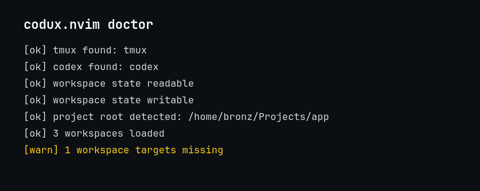

<p align="center">
  ⭐ If codux.nvim helps your workflow, consider starring the repo — it helps other Neovim users discover it.
</p>

<br>

<p align="center">
  
</p>

<h2 align="center">What is Codux?</h2>

<p align="center">
  Codux is a Neovim plugin that runs OpenAI Codex inside a persistent floating terminal.
</p>

<p align="center">
  Unlike chat-style AI plugins, Codux keeps you connected to a real Codex CLI session.<br>
  Send files, visual selections, diagnostics, Git diffs, and file explorer targets directly from Neovim without leaving your editor.
</p>

<p align="center">
  Close the window at any time; the Codex session keeps running in the background.
  Codux helps preserve and organize Codex context so you waste fewer tokens rebuilding prompts.
</p>

<h2 align="center">Why Codux?</h2>

<p align="center">
  Persistent Codex sessions<br>
  Floating terminal workflow<br>
  Built-in token monitoring<br>
  Native Neovim experience<br>
  No context loss between prompts
</p>

<p align="center">
  
</p>

<h2 align="center">Why not just use Codex in a terminal?</h2>

<p align="center">
  Using Codex in a separate terminal works, but it means:
</p>

<p align="center">
  Switching between editor and terminal<br>
  Losing focus while reviewing changes<br>
  Managing window layouts manually<br>
  No editor-native visibility into token usage
</p>

<p align="center">
  codux.nvim keeps your Codex workflow inside Neovim with:
</p>

<p align="center">
  Persistent sessions<br>
  Floating terminal integration<br>
  Built-in token monitoring<br>
  Fast toggling between code and AI
</p>

<div align="center">

<h2>Codux Workspaces with tmux</h2>

<p>
  Large development tasks rarely involve a single conversation.
</p>

<p>
  With tmux, you can dedicate a Codux session to a specific objective and keep that context alive while you work.
</p>

<p>
  <strong>Window 1 - Feature Development</strong><br>
  Implementing a new gameplay system<br>
  Codux focused on design decisions, code generation, and implementation details
</p>

<p>
  <strong>Window 2 - Code Review</strong><br>
  Reviewing your current branch<br>
  Codux focused on bugs, edge cases, performance issues, and refactoring opportunities
</p>

<p>
  <strong>Window 3 - Debugging</strong><br>
  Investigating a failing test or runtime issue<br>
  Codux focused on logs, diagnostics, stack traces, and root-cause analysis
</p>

<p>
  <strong>Window 4 - Architecture</strong><br>
  Planning larger changes<br>
  Codux focused on project structure, APIs, and long-term design decisions
</p>

<p>
  Each Codux session maintains its own conversation and context.
</p>

<p>
  Instead of constantly changing topics within a single AI conversation, you can keep dedicated Codux sessions attached to specific workflows and switch between them instantly from the workspace dashboard.
</p>

<p align="center">
  
</p>

<p>
  Use <code>:CoduxWorkspaceCreate</code> or <code>&lt;leader&gt;zw</code> inside tmux to create a guided Codex workspace.
  The create flow prompts for a name, opens the Vim-like instruction editor, then previews the instruction before launch.
  New workspace windows launch in the current file or explorer target's project root, so the workspace follows the same worktree and branch as the code you are working on.
</p>

<p>
  Inside tmux, Codux creates or reuses a <code>backend-debug</code> window in the current tmux session, restores Neo-tree to the same target when available, and starts new workspaces with your current Codex permission profile.
  Reopened saved workspaces keep their stored profile.
  Reopened saved workspaces resume the stored Codex session id when available, so the workspace returns to the same Codex conversation instead of starting a new one.
  Workspace windows use the requested workspace name for the tmux window.
  New guided workspaces open the Codux popup so you can confirm the startup prompt is running.
</p>

<p>
  Workspace names are persisted per project in <code>stdpath("data")/codux/workspaces.json</code>.
  Creating a workspace with an existing name shows <code>workspace already exists</code>.
</p>

<p>
  Use <code>:CoduxWorkspaces</code> or <code>&lt;leader&gt;zW</code> to open <code>current codux workspaces</code>.
  Codux opens a <code>Codux workspace:</code> search field above the dashboard; type a fuzzy workspace name to filter the dashboard and preview the closest match.
  Press <code>&lt;CR&gt;</code> in search to focus the highlighted dashboard result, then use dashboard shortcuts: <code>&lt;CR&gt;</code> to open, <code>r</code> to rename, <code>x</code> to close the workspace window, <code>d</code> to delete, and <code>h</code> to run doctor.
  Press <code>s</code> from the dashboard to search again, or <code>&lt;C-q&gt;</code> to close the dashboard and search field.
  Statuses show <code>active</code> when Codex is working, <code>question</code> when plan mode is waiting on your answer, <code>idle</code> when the workspace is open, or <code>inactive</code> when it is not open.
  The target column updates as each workspace moves between files or supported file explorer targets.
</p>

<p>
  Outside tmux, Codux shows <code>no tmux session running</code> and does not create a workspace.
</p>

<p>
  Workspace names are user-defined and sanitized for tmux window safety.
  Empty names and sanitized-name collisions are rejected with a clear error.
</p>

<h3>Workspace Restore and Doctor</h3>

<p>
  Use <code>:CoduxWorkspaceRestore</code> to reconcile saved workspace state with tmux after restarts.
  Saved workspace state also records the Codex session id after launch; older workspace records are seeded from the most recent local Codex session for the same project root the next time they are opened.
  Use <code>:CoduxDoctor</code>, or press <code>h</code> in the workspace dashboard, when troubleshooting external dependencies and saved workspace targets.
</p>

<p align="center">
  
</p>

</div>

## Manual Install

1. Add codux.nvim with lazy.nvim or LazyVim:

```lua
{
  "BRONZowl/codux.nvim",
  opts = {},
}
```

2. Run `:Lazy sync`, restart Neovim, then open Codux:

```vim
:Codux
```

In LazyVim, `<leader>` is usually Space. Codux also maps open to `<leader>zc`.

3. Install the Codex CLI and sign in if `codex` is not already available:

```bash
curl -fsSL https://chatgpt.com/codex/install.sh | sh
codex login
```

Confirm the CLI is available:

```bash
codex --version
```

4. Open a project and verify the setup:

```bash
cd ~/Projects/your-project
nvim
```

```vim
:checkhealth codux
:Codux
```

<h3 align="center">
  <strong>Or just have Codex do it.</strong>
</h3>

<p align="center">
  Ask Codex: <code>Install BRONZowl/codux.nvim in my LazyVim config.</code>
</p>

## Requirements

- Neovim with terminal and floating window support
- OpenAI Codex CLI available as `codex`
- lazy.nvim or LazyVim

Optional:

- which-key.nvim for the `<leader>z` group label
- tmux for `:CoduxWorkspaceCreate <name>`
- Neo-tree, Oil.nvim, nvim-tree, or mini.files for file explorer targets

This plugin was developed using Neo-tree in LazyVim.

Windows users can use WSL2 with the Linux install command above, or follow the official Codex Windows setup guide.

For remote or headless login:

```bash
codex login --device-auth
```

Codux sends requested files, selections, diagnostics, and health output through your configured Codex CLI session.

<h2 align="center">Usage</h2>

<table align="center">
<tr>
<th>Action</th>
<th>Key</th>
<th>Command</th>
</tr>
<tr>
<td>Open or focus Codex</td>
<td><code>&lt;leader&gt;zc</code></td>
<td><code>:Codux</code></td>
</tr>
<tr>
<td>Open Codex autopilot with approve-for-me permissions</td>
<td><code>&lt;leader&gt;za</code></td>
<td><code>:CoduxOpenAuto</code></td>
</tr>
<tr>
<td>Open Codex danger zone with no sandbox</td>
<td><code>&lt;leader&gt;zA</code></td>
<td><code>:CoduxOpenDanger</code></td>
</tr>
<tr>
<td>Create a guided tmux workspace</td>
<td><code>&lt;leader&gt;zw</code></td>
<td><code>:CoduxWorkspaceCreate</code></td>
</tr>
<tr>
<td>Manage current Codux workspaces</td>
<td><code>&lt;leader&gt;zW</code></td>
<td><code>:CoduxWorkspaces</code></td>
</tr>
<tr>
<td>Send current file or explorer node</td>
<td><code>&lt;leader&gt;zf</code></td>
<td><code>:CoduxReview</code></td>
</tr>
<tr>
<td>Send selected code</td>
<td><code>&lt;leader&gt;zs</code></td>
<td><code>:&#39;&lt;,&#39;&gt;CoduxReviewSelection</code></td>
</tr>
<tr>
<td>Send diagnostics and health output</td>
<td><code>&lt;leader&gt;zd</code></td>
<td><code>:CoduxDiagnostics</code></td>
</tr>
<tr>
<td>Send Git changes</td>
<td><code>&lt;leader&gt;zg</code></td>
<td><code>:CoduxDiff</code></td>
</tr>
<tr>
<td>Toggle Codex plan mode</td>
<td><code>&lt;leader&gt;zp</code></td>
<td><code>:CoduxTogglePlan</code></td>
</tr>
<tr>
<td>Hide the popup</td>
<td><code>&lt;C-q&gt;</code></td>
<td><code>:CoduxClose</code></td>
</tr>
<tr>
<td>Close Codux dashboards and prompts</td>
<td><code>&lt;C-q&gt;</code></td>
<td></td>
</tr>
<tr>
<td>Start typing after scrolling</td>
<td>Type normally</td>
<td></td>
</tr>
<tr>
<td>Stop Codex</td>
<td></td>
<td><code>:CoduxExit</code></td>
</tr>
<tr>
<td>Troubleshoot Codux setup</td>
<td><code>h</code> in workspace dashboard</td>
<td><code>:CoduxDoctor</code></td>
</tr>
</table>

<p align="center">
  <code>:CoduxOpenDanger</code> starts Codex with no approval prompts and no sandbox. Use it only in repositories you trust.
</p>

<h2 align="center">Token Monitoring</h2>

<p align="center">
  The <code>&lt;leader&gt;z</code> menu header shows the current Codux-tracked status and token usage while Codux is running:<br>
  <code>codux execute | 5hr 3% | wk 5%</code><br>
  <code>codux plan | 5hr 3% | wk 5%</code>
</p>

<p align="center">
  Token monitoring refreshes in the background only while Codux is running. The popup can be hidden, but the Codex session must still be active. If usage is unavailable while Codux is running, Codux shows <code>--%</code> placeholders. Status text is green for execute, purple for plan, and red when Codex is not running.
</p>

<p align="center">
  When Codex is actively working and the popup is hidden, Codux shows a small <code>codex is working...</code> indicator near the bottom-right of the editor. The indicator clears when Codex goes idle, is interrupted, or exits.
</p>

<h2 align="center">Roadmap</h2>

<p align="center">
  codux.nvim is focused on persistent, organized Codex context rather than autonomous background loops.
  Upcoming work will focus on improving saved workspace management and dashboard ergonomics.
  Future task-run features should stay bounded and human-approved, with explicit step limits, visible token awareness, and pauses before continuing.
</p>
